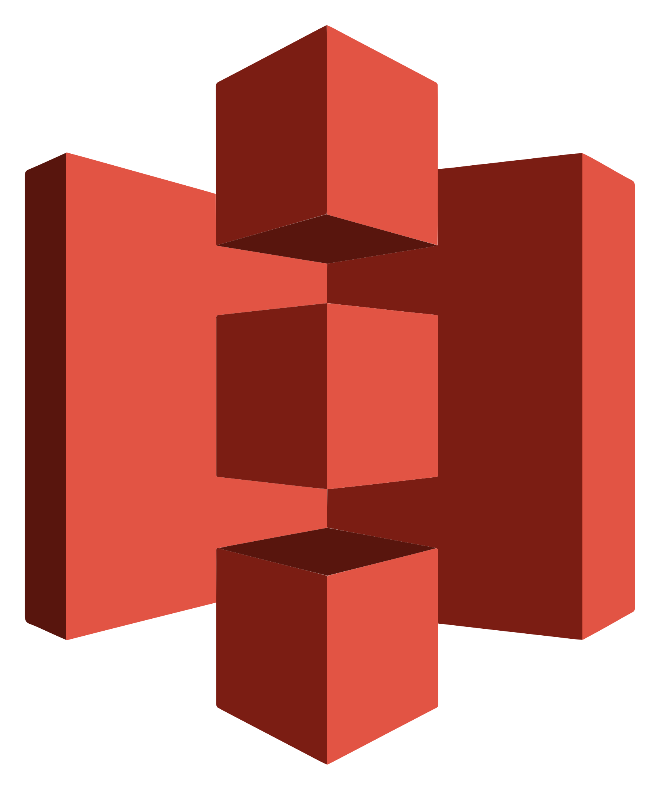

# Contact/Social Network

    
    

  

# Skills

### Programming language

    
    
    
    
     
    
    
    
    

### Cloud/Services

    
    
    
     
    
    
    
    

 

### Frameworks

    
    
    
    
    
    
    
    
     
    
    
    
    
    
    
    
    
    

 

### SQL/NoSQL/Object Storage

    
    
    
     
    
    
    

 
    
### IA

    
    
    

 

### Operational System

    
    
    
    

 

### Terminal

    
    
    
    

 

### IDEs/Softwares

    
    
    
    
    
     
    

 

### Container

    

 

### Design

    
    
    

 

### Project management

    
    
    
    
    

 

### Office

    
    
    

